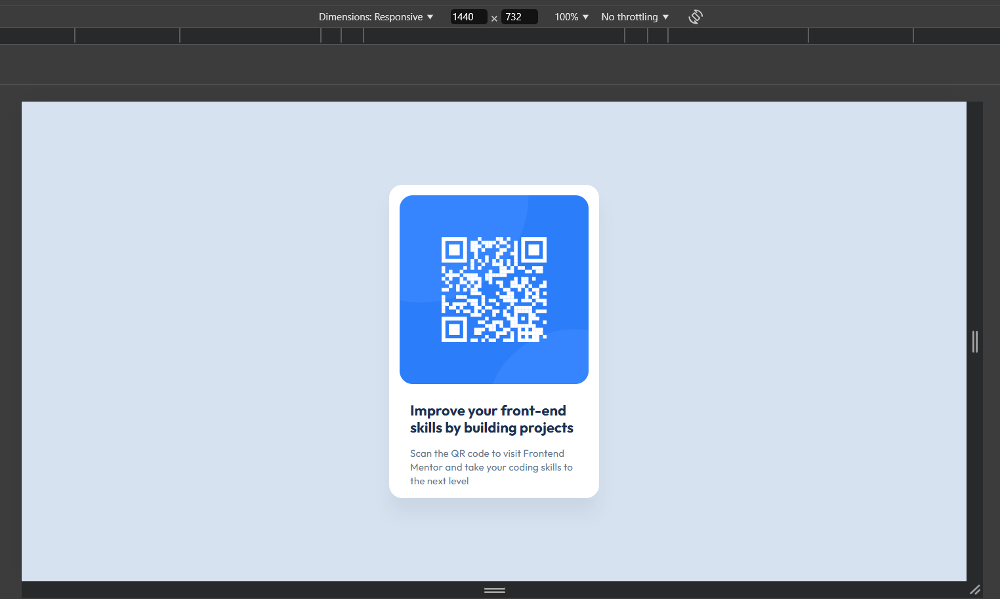
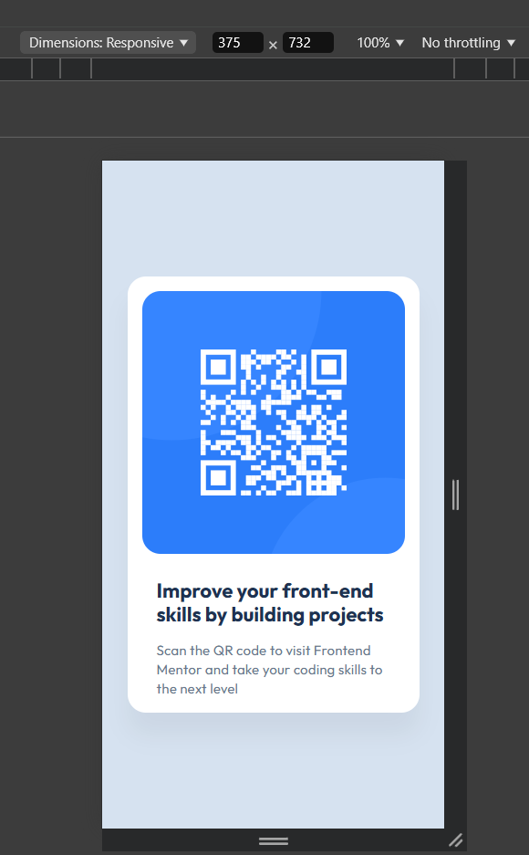

# Frontend Mentor - QR code component solution

This is a solution to the [QR code component challenge on Frontend Mentor](https://www.frontendmentor.io/challenges/qr-code-component-iux_sIO_H).

## Table of contents

- [Overview](#overview)
  - [Screenshot](#screenshot)
  - [Links](#links)
- [My process](#my-process)
  - [Built with](#built-with)
  - [What I used](#what-i-used)
- [Author](#author)

## Overview

### Screenshot




### Links

- Solution URL: [Add solution URL here](https://your-solution-url.com)
- Live Site URL: [Add live site URL here](https://your-live-site-url.com)

## My process

### Built with

- Semantic HTML5 markup
- CSS custom properties
- Flexbox

### What I used

For creating responsive layouts, I used:

- The max-width property for .container
- width: 100% for .code-img to ensure it scales with its parent element
- rem units instead of px for better scalability and consistency across devices

```html
<div class="container">
  
  <div class="text-container">
    <h2 class="text-header">Improve your front-end skills by building projects</h2>
    <p class="text-description">
      Scan the QR code to visit Frontend Mentor and take your coding skills to the next level
    </p>
  </div>
</div>
```

```css
.container {
  max-width: 32rem;
  background-color: var(--white);
  border-radius: 2rem;
  padding: 1.6rem;
  box-shadow: 0 2.5rem 2.5rem 0 rgba(0, 0, 0, 0.05);
}

.code-img {
  width: 100%;
  border-radius: 2rem;
  margin-bottom: 2.4rem;
}
```

## Author

- Frontend Mentor - [@frontend-dev](https://www.frontendmentor.io/profile/MarinaIvantsova)
